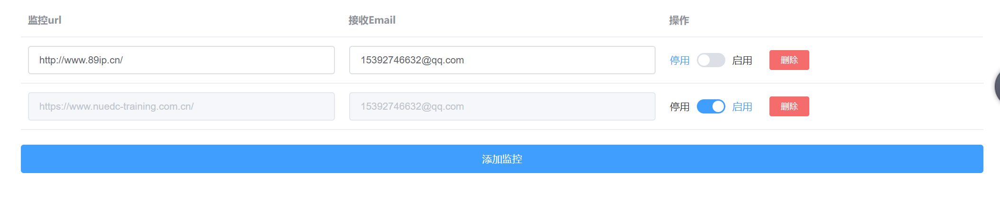

# monitor
又快电子大赛了，好怀念那充满激情和乐趣的感觉。写了个小工具供有需要的同学使用，监控网页改变邮件通知，及时获取大赛信息，赛题发布。

##### 如何使用：

1. 安装 Python 3.7 
2. 安装依赖包 requirement
3. 运行 server.py
4. 打开浏览器访问 <http://localhost:9999/view/monitor.html> 添加要监控的网页
5. 

当网页有变化就可以收到邮件了。

